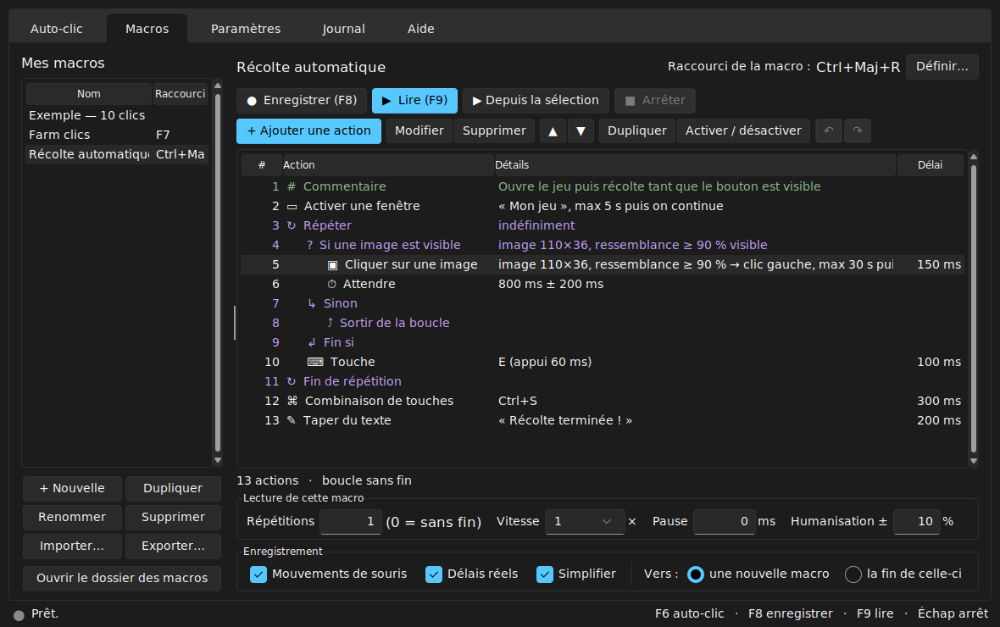
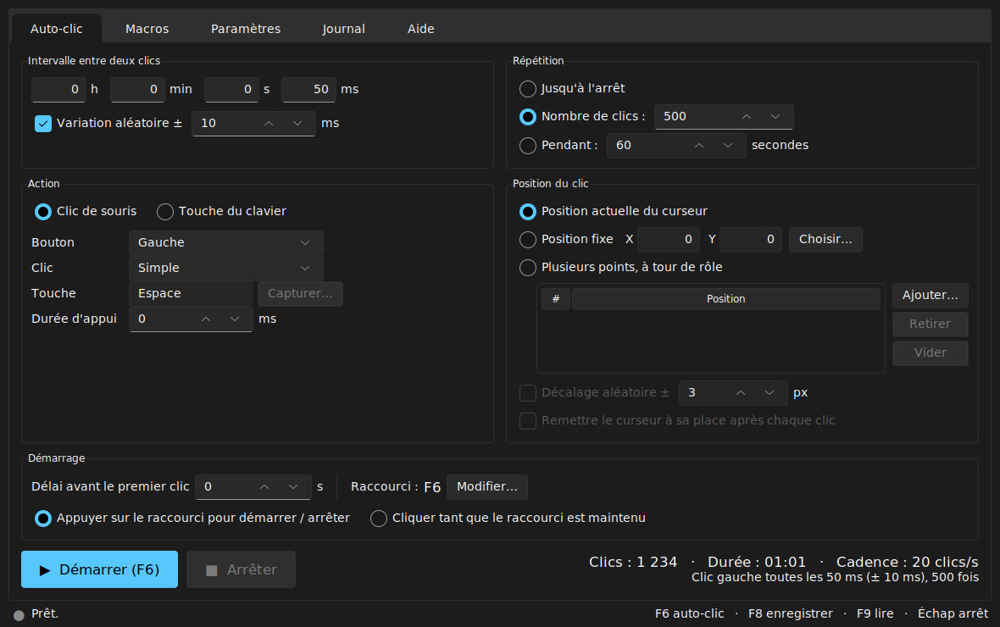
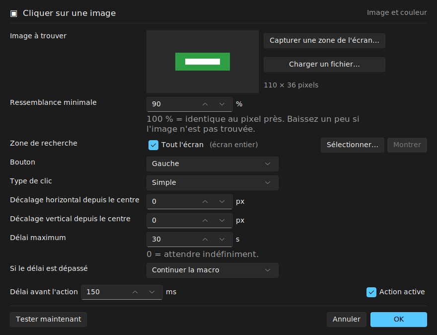

# Autoclique IA

**Auto-clicker et enregistreur de macros complet** pour Windows, macOS et Linux :
clics automatiques, enregistrement et lecture de la souris et du clavier, éditeur
de macros avec boucles et conditions, et reconnaissance d'image et de couleur à l'écran.
L'interface est entièrement en français, en thème sombre ou clair.



## Fonctionnalités

**Auto-clic**
- Intervalle réglable en heures, minutes, secondes et millisecondes (jusqu'à ~1 000 clics/s), avec variation aléatoire.
- Bouton gauche, droit, milieu ou latéraux ; clic simple, double ou triple ; durée d'appui.
- Mode « touche du clavier » pour répéter une touche.
- Position actuelle, position fixe ou **plusieurs points à tour de rôle**, avec décalage aléatoire et retour du curseur.
- Arrêt après N clics, après une durée, ou manuel.
- Raccourci global (F6 par défaut) en mode **basculer** ou **maintenir pour cliquer**.

**Macros**
- **Enregistrement** de la souris (clics, glisser, molette, mouvements) et du clavier, avec simplification automatique (clics, doubles clics, appuis de touche).
- **Éditeur** complet : ajouter, modifier, déplacer, dupliquer, désactiver des actions ; copier/coller entre macros ; annuler/rétablir ; sauvegarde automatique.
- 26 types d'actions : clics, mouvements (instantanés ou fluides), molette, touches, combinaisons (Ctrl+C…), saisie de texte, attentes (fixes ou aléatoires), **boucles**, **conditions si/sinon**, sortie de boucle, appel d'une autre macro, ouverture d'un programme ou d'un site, activation d'une fenêtre, commentaires.
- **Reconnaissance d'écran** : attendre une couleur, attendre une image, cliquer sur une image où qu'elle soit, conditions « si l'image est visible » / « si la couleur est présente ». Capture de l'image directement à l'écran et bouton « Tester maintenant ».
- Lecture avec répétitions (ou sans fin), vitesse ×0,25 à ×10, pause entre répétitions, **humanisation** des délais, lecture à partir d'une action.
- Un **raccourci global par macro**, bibliothèque avec import/export (un fichier `.json` autonome, images comprises).

**Sécurité**
- Arrêt d'urgence global (Échap par défaut) et arrêt en plaquant la souris dans le coin supérieur gauche.
- Toutes les touches et tous les boutons encore enfoncés sont relâchés à l'arrêt.
- Les touches envoyées par une macro ne déclenchent pas les raccourcis d'Autoclique.

## Installation

### Windows : l'exécutable

Téléchargez `AutocliqueIA.exe` depuis la page **Releases** du dépôt (ou l'artefact
« AutocliqueIA-windows » de la dernière exécution du workflow *Exécutable Windows*
dans l'onglet **Actions**), puis lancez-le : aucune installation n'est nécessaire.

> Windows SmartScreen ou l'antivirus peuvent afficher un avertissement : c'est courant pour
> un programme non signé qui contrôle la souris et le clavier. Vous pouvez aussi lancer
> Autoclique depuis les sources (ci-dessous).

### Depuis les sources (toutes plateformes)

Prérequis : [Python 3.9 ou plus récent](https://www.python.org/downloads/)
(sous Windows, cochez « Add python.exe to PATH »).

- **Windows** : double-cliquez sur `Lancer-Autoclique.bat`.
- **Linux / macOS** : lancez `./lancer.sh`.

Au premier lancement, le script crée un environnement Python dans `.venv` et installe les
dépendances. Installation manuelle équivalente :

```bash
python -m pip install -r requirements.txt
python -m autoclique
```

Facultatif : `pip install opencv-python-headless` accélère la recherche d'image sur les grands écrans.

**Linux** : une session **X11** est nécessaire (Wayland n'est pas pris en charge), ainsi que
Tkinter (`sudo apt install python3-tk` sur Debian/Ubuntu). L'action « Activer une fenêtre »
utilise `wmctrl` ou `xdotool` s'ils sont installés.

**macOS** : autorisez le terminal (ou Python) dans *Réglages Système > Confidentialité et
sécurité > Accessibilité* **et** *Surveillance de l'entrée*.

## Prise en main

### Auto-clic



1. Réglez l'intervalle, l'action (clic ou touche) et la position.
2. Cliquez sur **Démarrer** ou appuyez sur **F6**, n'importe où.
3. Appuyez de nouveau sur **F6** (ou **Échap**) pour arrêter.

Pour cliquer à un endroit précis, choisissez « Position fixe » puis **Choisir…** : l'écran
se fige et une loupe vous aide à cliquer au pixel près.

### Enregistrer une macro

1. Onglet **Macros** > **Enregistrer** (ou **F8**). La fenêtre se réduit.
2. Faites vos actions.
3. Appuyez sur **F8** pour terminer : la macro apparaît dans la liste, prête à être lue (**F9**).

Options : « Mouvements de souris » (sinon la souris saute d'un clic à l'autre), « Délais réels »
(sinon délai fixe), « Simplifier » (regroupe appui + relâchement).

### Modifier une macro



- **Double-clic** sur une action pour la modifier, **clic droit** pour le menu complet.
- **+ Ajouter une action** insère après la sélection.
- Sélectionnez plusieurs actions puis *Ajouter > Contrôle > Répéter* : elles sont
  automatiquement placées dans la boucle. Même principe avec *Si une image est visible*.
- Raccourcis de l'éditeur : `Suppr`, `Entrée` (modifier), `Espace` (activer/désactiver),
  `Ctrl+C/X/V`, `Ctrl+D` (dupliquer), `Ctrl+Z/Y`, `Ctrl+↑/↓` (déplacer), `Ctrl+A`.
- Une erreur de structure (boucle non fermée…) est signalée en rouge et empêche la lecture.

### Reconnaissance d'image et de couleur

- **Cliquer sur une image** : cliquez sur *Capturer une zone de l'écran…* et entourez le
  bouton ou l'icône à trouver, puis **Tester maintenant**. Lors de la lecture, Autoclique le
  cherche à l'écran (où qu'il soit) et clique en son centre, avec un décalage optionnel.
- **Ressemblance minimale** : 90 % convient la plupart du temps. Baissez à 80–85 % si l'image
  change légèrement (animation, transparence).
- **Zone de recherche** : limiter la recherche à une partie de l'écran la rend plus rapide.
- **Attendre une couleur** / **Si une couleur est présente** : *Choisir à l'écran…* relève la
  position et la couleur du pixel en une fois.
- Les images doivent être capturées avec la même mise à l'échelle d'affichage (125 %, 150 %…)
  que lors de la lecture.

### Raccourcis globaux (modifiables dans Paramètres)

| Raccourci | Action |
|-----------|--------|
| **F6** | Démarrer / arrêter l'auto-clic |
| **F8** | Démarrer / arrêter l'enregistrement |
| **F9** | Lire / arrêter la macro sélectionnée |
| **Échap** | Arrêt d'urgence (tout arrêter) |
| *au choix* | Lancer une macro précise (bouton « Définir… » de la macro) |

Les boutons latéraux et le clic milieu de la souris peuvent servir de raccourci. Pendant
un enregistrement, seul le raccourci d'enregistrement agit : toutes les autres touches
(y compris Échap) sont enregistrées.

## Ligne de commande

```bash
python -m autoclique                        # interface graphique
python -m autoclique list                   # macros de la bibliothèque
python -m autoclique play "Ma macro" -r 3   # lire une macro trois fois
python -m autoclique play macro.json -s 2   # lire un fichier, deux fois plus vite
python -m autoclique play macro.json --dry-run   # simuler sans toucher à la souris
python -m autoclique click -i 50 -n 200     # 200 clics, un toutes les 50 ms
python -m autoclique click --at 800 450 -d 30 --double
python -m autoclique click -k espace -i 1000     # appuyer sur Espace chaque seconde
python -m autoclique record sortie.json     # enregistrer jusqu'à l'appui sur F8
```

`Ctrl+C` ou la touche d'arrêt d'urgence interrompent l'exécution. Pratique pour lancer une
macro depuis le Planificateur de tâches de Windows ou `cron`.

## Où sont mes macros ?

| Système | Dossier |
|---------|---------|
| Windows | `%APPDATA%\Autoclique IA` |
| macOS | `~/Library/Application Support/Autoclique IA` |
| Linux | `~/.config/autoclique-ia` |

Le bouton *Paramètres > Ouvrir le dossier* y mène directement. Chaque macro est un fichier
JSON lisible dans le sous-dossier `macros` ; les images de reconnaissance y sont intégrées.
La variable d'environnement `AUTOCLIQUE_HOME` permet d'utiliser un autre dossier (clé USB…).

## Dépannage

- **Les clics ne fonctionnent pas dans un jeu** : augmentez la « durée d'appui » (30–50 ms) ;
  certains jeux lancés en administrateur exigent de lancer Autoclique en administrateur.
- **Les positions sont décalées** (écran à 125 % ou 150 %) : Autoclique se déclare
  compatible haute résolution ; utilisez **Choisir à l'écran** plutôt que des coordonnées
  mesurées avec un autre outil.
- **L'image n'est jamais trouvée** : utilisez *Tester maintenant*, qui encadre la zone la plus
  ressemblante et affiche son score ; recapturez l'image ou baissez la ressemblance.
- **La macro s'arrête toute seule** : consultez l'onglet **Journal** ; l'arrêt de sécurité du
  coin de l'écran se désactive dans les paramètres.
- Un journal détaillé est écrit dans `autoclique.log`, dans le dossier des données.

## Développement

```
autoclique/
  core/        moteur sans interface : touches, actions, macros, lecteur, auto-clic,
               enregistreur, raccourcis globaux, capture et recherche d'image, stockage
  gui/         interface Tkinter (thème sv-ttk) : onglets, éditeur d'action, sélection à l'écran
  cli.py       ligne de commande
tests/         tests pytest (moteur, interface, intégration réelle)
tools/         génération de l'icône, construction de l'exécutable
```

```bash
pip install -r requirements.txt pytest
python -m pytest                                  # tests du moteur et de l'interface
AUTOCLIQUE_INTEGRATION=1 python -m pytest         # + tests pilotant la vraie souris
pip install pyinstaller && python tools/build_exe.py   # exécutable dans dist/
```

Sous Linux sans écran : `xvfb-run -a python -m pytest`. L'intégration continue (GitHub
Actions) exécute les tests sous Linux et Windows (Python 3.9 et 3.12) et construit
`AutocliqueIA.exe` ; pousser une étiquette `v1.2.3` publie l'exécutable dans une version.

## Utilisation responsable

Automatiser des clics peut être interdit par les conditions d'utilisation de certains jeux
ou services en ligne. Vous êtes responsable de l'usage que vous faites d'Autoclique IA.
